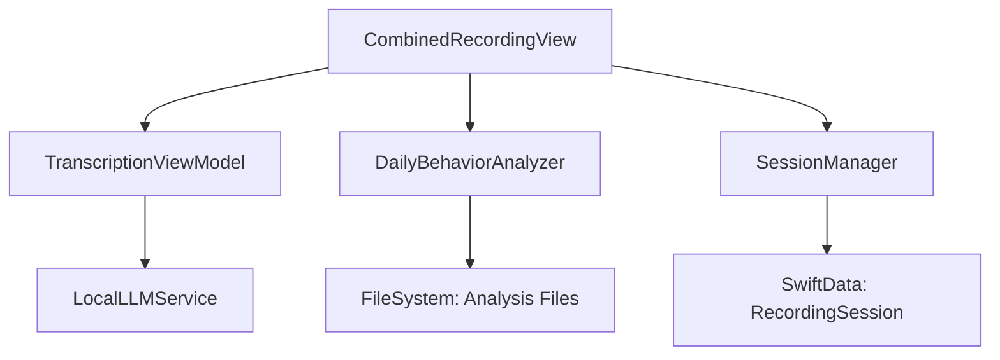

# MacAudioRecorder Project Dependencies and Implementation Analysis

## Current Architecture

### Core Components
1. **MainTabView** (MacAudioRecorderApp.swift)
   - Root view with two tabs: Recording and Sessions
   - Manages shared `activeSession` state

2. **DailyBehaviorAnalyzer** (DailyBehaviorAnalyzer.swift)
   - Handles daily behavioral analysis aggregation
   - Key structures:
     - `DailySummary`: Daily analysis results
     - `BehaviorCounts`: Category-level behavior counting

3. **LocalLLMService** (LocalLLMService.swift)
   - Wrapper for local LLM integration
   - Handles:
     - Workplace analysis
     - General summarization
     - Behavioral analysis

4. **TranscriptionViewModel** (TranscriptionViewModel.swift)
   - Manages transcription state and analysis
   - Bridges Whisper transcription with LLM analysis

5. **CombinedRecordingView** (CombinedRecordingView.swift)
   - Main recording interface
   - Integrates recording, transcription, and analysis

6. **SessionsListView** (SessionsListView.swift)
   - Manages recording sessions
   - Handles session metadata and file management

### Data Flow

## Implementation Feasibility Analysis

### Most Feasible Enhancements (Least Code Changes Required)

1. **Time Range Analytics** (HIGH FEASIBILITY)
   - Existing Infrastructure:
     - `DailyBehaviorAnalyzer` already handles date-based analysis
     - `findBehavioralFiles(for date:)` can be extended for ranges
   - Required Changes:
     - Add range selection UI to existing date picker
     - Extend file finding logic for date ranges
     - Aggregate existing daily summaries

2. **Individual Behavior Tracking** (MEDIUM-HIGH FEASIBILITY)
   - Existing Infrastructure:
     - `BehaviorCounts` structure can be extended
     - Pattern matching logic in place
   - Required Changes:
     - Extend `BehaviorCounts` to track 19 behaviors
     - Update pattern matching in `extractNetTilt`
     - Add new UI elements for detailed behavior display

3. **Basic Charts Integration** (MEDIUM-HIGH FEASIBILITY)
   - Existing Infrastructure:
     - Clean SwiftUI architecture
     - Glass effect styling
   - Required Changes:
     - Add SwiftUI Charts framework
     - Create chart components using existing data structures
     - Integrate with existing tab structure

### Moderate Effort Enhancements

4. **Sentiment Scoring** (MEDIUM FEASIBILITY)
   - Existing Infrastructure:
     - LocalLLMService integration
     - Text analysis patterns
   - Required Changes:
     - Add sentiment analysis to LLM prompts
     - Create sentiment scoring model
     - Add UI for sentiment display

5. **Analytics Dashboard Tab** (MEDIUM FEASIBILITY)
   - Existing Infrastructure:
     - TabView structure
     - SwiftUI components
   - Required Changes:
     - Create new Analytics tab
     - Design dashboard layout
     - Integrate charts and filters

### More Complex Enhancements

6. **Advanced Analytics Features** (LOWER FEASIBILITY)
   - Correlation Analysis
   - Predictive Insights
   - Machine Learning Integration
   - These require significant new infrastructure

## Potential Issues and Mitigation

1. **Performance Concerns**
   - Issue: Time range analysis may be slow for large date ranges
   - Mitigation: Implement pagination and caching

2. **Data Consistency**
   - Issue: Maintaining consistency across different analysis types
   - Mitigation: Create central data coordination service

3. **UI Responsiveness**
   - Issue: Chart rendering may impact performance
   - Mitigation: Implement lazy loading and data windowing

4. **Memory Management**
   - Issue: Large datasets in memory for analytics
   - Mitigation: Implement data streaming and cleanup

## Implementation Priority Order

1. Time Range Analytics
   - Minimal changes to existing code
   - High impact on functionality
   - Natural extension of current features

2. Individual Behavior Tracking
   - Builds on existing pattern matching
   - Requires moderate UI updates
   - Essential for advanced analytics

3. Basic Charts
   - Independent of other changes
   - Immediate visual impact
   - Foundation for dashboard

4. Analytics Dashboard Tab
   - Depends on previous implementations
   - Significant UI work
   - High user value

5. Sentiment Analysis
   - Can be added incrementally
   - Requires LLM optimization
   - Enhanced insights

## Technical Recommendations

1. **Code Organization**
   - Create separate modules for analytics
   - Use protocol-based abstractions
   - Implement clean architecture patterns

2. **Testing Strategy**
   - Unit tests for new analytics logic
   - UI tests for chart interactions
   - Performance testing for time range queries

3. **Data Management**
   - Implement caching layer
   - Use efficient data structures
   - Consider local database for analytics

4. **UI/UX Considerations**
   - Maintain existing glass effect theme
   - Ensure consistent styling
   - Progressive disclosure of complex features